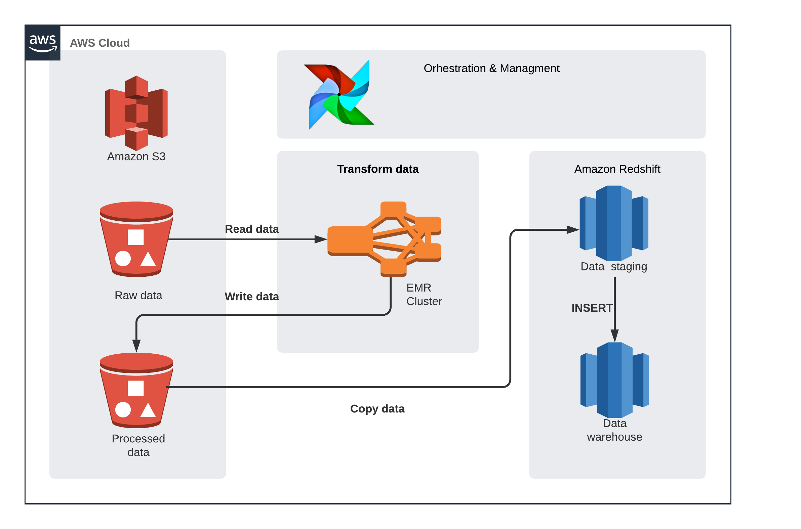
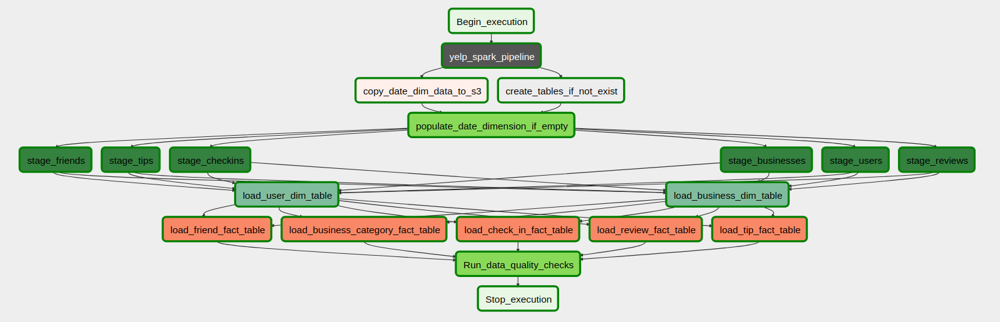
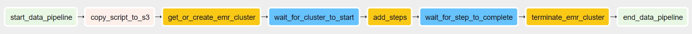
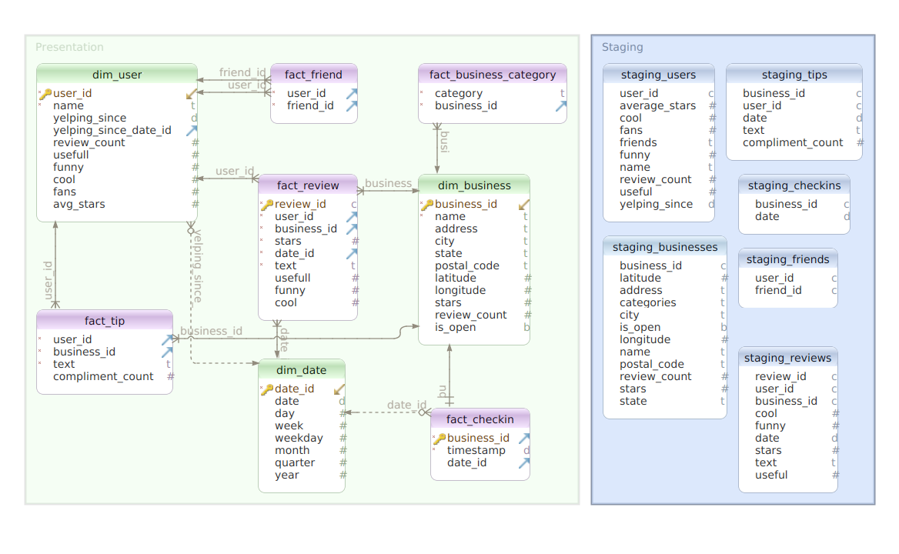

# Yelp ETL Pipeline
<p align="center">
  
</p>

# Description
In this project the goal is to build data warehouse tables that later can be used for EDA.  

# Data Source

In this project this dataset was used - https://www.kaggle.com/yelp-dataset/yelp-dataset.<br>
The dataset contains 8,635,403 reviews, 160,585 businesses, 1,162,119 tips by 2,189,457 users.<br> 
Aggregated check-ins over time for each of the 138,876 businesses. <br>
Information about businesses covers 8 metropolitan areas in the USA and Canada.

# Architecture


## Overview


## ETL flow
- Spark job transforms data using s3
- Warehouse schema is created 
- Date dimension is created and populated
- Staging area is populated
- The rest of the dimension tables are populated
- Fact tables are populated
- Data quality checks are run


Airflow dag:

Spark subdag:


## Project structure


## Data warehouse schema



# Environment Setup


# Instructions


## Step 2: Explore and Assess the Data
Explore the data to identify data quality issues, like missing values, duplicate data, etc.
Document steps necessary to clean the data

## Step 3: Define the Data Model
Map out the conceptual data model and explain why you chose that model
List the steps necessary to pipeline the data into the chosen data model

## Step 4: Run ETL to Model the Data
Create the data pipelines and the data model
Include a data dictionary
Run data quality checks to ensure the pipeline ran as expected
Integrity constraints on the relational database (e.g., unique key, data type, etc.)
Unit tests for the scripts to ensure they are doing the right thing
Source/count checks to ensure completeness

## Step 5: Complete Project Write Up
What's the goal? What queries will you want to run? How would Spark or 
Airflow be incorporated? Why did you choose the model you chose?
Clearly state the rationale for the choice of tools and technologies for the project.
Document the steps of the process.
Propose how often the data should be updated and why.
Post your write-up and final data model in a GitHub repo.

# Scenarios
- If the data was increased by 100x.
- If the pipelines were run on a daily basis by 7am.
- If the database needed to be accessed by 100+ people.
 
TODO: 
- add data dictionary


# How to setup project
1) Add airflow connections with following connection names:
   1) aws_credentials. Connection type - Amazon Web Services, Login= aws_access_key,
   Password - aws_secret_key. Set the region name in the "Extra" field(used by spark) 
   ```json
    {
    "region_name": "us-east-1"
   }   
    ```
   2) emr_credentials. Just copy aws_credentials without extra field.
   3) redshift. Select connection type - Postgres, and populate other details
