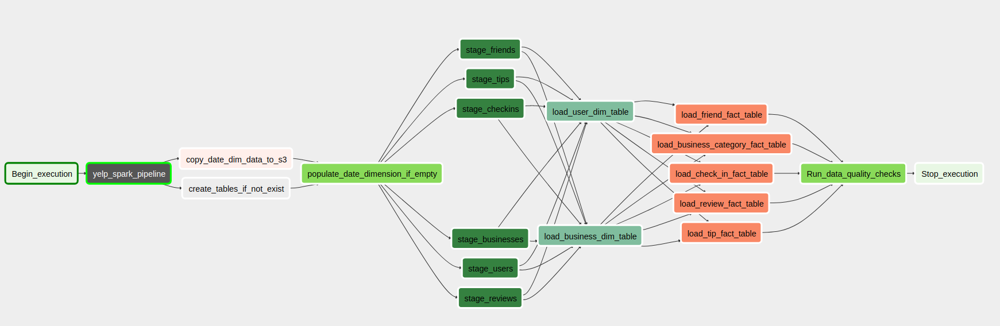

# Yelp ETL Pipeline
<p align="center">
  
</p>

# Description
In this project the goal is to build data warehouse tables that later can be used for EDA. The data warehouse should be 
able to give an answer to questions like:
- Rating distribution
- Show number of businesses by category
- Show number of businesses by city
- Find top businesses in the city
- Show how review count grows per selected business by time
- Customer satisfaction changes over period of time for selected business
- Find top businesses by location
- Find top business in the category
- Get top users by review count
- Show how many customers check in based on date
- Check-ins distribution

# Data Source

In this project this dataset was used - https://www.kaggle.com/yelp-dataset/yelp-dataset. <br>
The dataset contains 8,635,403 reviews, 160,585 businesses, 1,162,119 tips by 2,189,457 users.<br> 
Aggregated check-ins over time for each of the 138,876 businesses. <br>
Information about businesses covers 8 metropolitan areas in the USA and Canada.

The dataset on yelp's website contains 
[description of the fields in the json files](https://www.yelp.com/dataset/documentation/main).

## Steps necessary to clean the data
As this is an academic dataset it was already cleaned up for the most part. When inserting data into
fact_business_category_tables there were empty values. Currently, the query which inserts this data filters out
blank values

## Data Model


As the goal of this project is exploratory data analysis there are a lot of tables which data scientist/analysts can 
use to answer questions regarding different aspects of the provided data.

### Overview of the tables:
- fact_review. As the heart of the data is the users' review this table represents different aspects of this review. 
- fact_friend - factless fact table to represent user-friend relation
- fact_business_category - factless fact table to represent business-category relation. Business categories are 
represented as list in the json source file. Currently, in the [insert query](airflow/plugins/helpers/table_insert_queries.py) 
there is a sequence that is used to split the list from the json. Currently, the max number of categories is about 20.
This small number makes it viable to unnest list using data warehouse
- fact_tip - fact tables for tips.
- fact_checkin - fact table for checkins.  Check-in dates are represented as list in a json file. Splitting this list using 
data warehouse takes a long time as there are a lot of check-ins. Instead, it is done using Spark framework. 
- dim_business - business dimension table.
- dim_user - user dimension table.
- dim_date - date dimension table. This dimension is populated using [csv file](airflow/dags/data/dim_date.csv). 


Data dictionary with the column description/source is included in the [data dictionary file](data_dictionary.txt)


# Architecture


## Overview
The user flow is next - the data is copied into raw data zone. After this user should trigger 
airlfow dag manually to kick of the pipeline. After the end of the pipeline the target tables are populated.

## ETL flow
- Spark job, that is run on the an EMR cluster, transforms data using s3 
- Warehouse schema is created 
- Date dimension is created and populated
- Staging area is populated
- The rest of the dimension tables are populated
- Fact tables are populated
- Data quality checks are run


# Environment Setup

### Hardware used: 

EMR - currently it's more than enough to spawn 3 m5.xlarge EC2 instances which have:
```
4 vCore, 16 GiB memory, EBS only storage
EBS Storage:64 GiB
```
This configuration is located in [the spark subdag file](airflow/dags/yelp_spark_pipeline.py)

Redshift - Currently I spawn redshift cluster with 2 dc2.large instances

### Setting up Airflow

Currently, this project was tested with airflow 1.10.15. AWS provides an option to deploy managed 
airflow instance or this project can be used with standalone airflow application. This project contains 
docker-compose file to spin up an airflow stack. 

After starting airflow you should be able to see the dag

and spark subdag:


Before running the yelp dag:
1) Configure airflow variables which don't have default value or change according to your configuration

|  Name                          | Description                                                            | Default                                      |
|--------------------------------|------------------------------------------------------------------------|----------------------------------------------|
| dimenions_load_mode            | mode for dimension load. Available values [ 'append' ,  'delete-load'] | delete-load                                  |
| redshift_conn_id               | connection id used to connect to redshift                              | redshift                                     |
| aws_credentials_conn_id        | connection id used for s3 and EMR                                      | aws_credentials                              |
| redshift_schema                | schema to be used to create/insert into tables                         | public                                       |
| s3_bucket                      | s3 bucket used for raw/processed data                                  |                                              |
| raw_business_data_s3_key       | relative path in s3 bucket for business data                           | data/raw/yelp_academic_dataset_business.json |
| raw_user_data_s3_key           | relative path in s3 bucket for users data                              | data/raw/yelp_academic_dataset_user.json     |
| raw_reviews_data_s3_key        | relative path in s3 bucket for reviews data                            | data/raw/yelp_academic_dataset_review.json   |
| raw_tip_data_s3_key            | relative path in s3 bucket for tip data                                | data/raw/yelp_academic_dataset_tip.json      |
| raw_check_in_data_s3_key       | relative path in s3 bucket for check-in data                           | data/raw/yelp_academic_dataset_checkin.json  |
| processed_check_in_data_s3_key | relative path in s3 bucket for processed check-in data                 | data/processed/check-ins/                    |
| processed_friend_data_s3_key   | relative path in s3 bucket for processed friend data                   | data/processed/friends/                      |
| emr_credentials_conn_id        | connection id used to create EMR cluster                               | emr_credentials                              |
| aws_region                     | aws region used to create EMR cluster                                  | us-west-2                                    |
| emr_log_uri                    | EMR cluster logs location                                              |                                              |

2) Add airflow connections with following connection names (according to previous step):
- aws_credentials. Connection type - Amazon Web Services, Login= aws_access_key,
Password - aws_secret_key. Set the region name in the "Extra" field(used by spark) 
   ```json
    {
    "region_name": "us-east-1"
   }   
    ```
- emr_credentials. Just copy aws_credentials without extra field.
- redshift. Select connection type - Postgres, and populate other details

### Setting up Redshift
[Dwh folder](/dwh) contains instructions on how to create Redshift cluster. 

### Setting up EMR

Current EMR configuration uses next 2 roles - EMR_EC2_DefaultRole and EMR_DefaultRole default role. Make sure to check 
that you have them
```shell
aws iam list-roles | grep 'EMR_DefaultRole\|EMR_EC2_DefaultRole'
```

```shell
  "RoleName": "EMR_DefaultRole",
  "RoleName": "EMR_EC2_DefaultRole",
```
If the roles not present, create them using the following command

```shell
aws emr create-default-roles
```

# Scenarios
- If the data was increased by 100x <br>

Currently, the dataset has about 10.5 GB of data if we do not take into account processed data.
So if the data was increased by 100x it's about 1 TB. Increasing redshift cluster and EMR cluster 
sizes should accommodate the data increase. After the data increase there will be some performance
bottlenecks. Probably on the redshift side. And good performance analysis should identify them. After which we can propose
some recommendations. Currently, the most of the pipeline time is spent on copying reviews to the staging table. It's mostly 
because it has 1 file with 6.5 GB of data.
So if we would have more data, having partition size with equal size and compression would make more difference.
As it is written in [copy command docs](https://docs.aws.amazon.com/redshift/latest/dg/t_loading-tables-from-s3.html) 
> Before uploading the file to Amazon S3, split the file into multiple files so that the COPY command can load it using 
> parallel processing. The number of files should be a multiple of the number of slices in your
> cluster. Split your load data files so that the files are about equal size, between 1 MB and 1 GB after compression.

- If the pipelines were run on a daily basis by 7am

Currently, pipeline is build as one time job. To support continuous DML changes next thing would be needed:
1) Add upsert functionality and slowly changing dimensions if needed
2) Add surrogate keys for tables
3) Add some unique identifier (like date) for raw and processed s3 zones
4) If needed enable catch up flag
5) it would also make sense to change existing logic and add some timeout for current airflow tasks
- If the database needed to be accessed by 100+ people

As there is a limitation for redshift - each user defined queue can handle maximum 50 concurrent queries next steps 
should increase cluster throughput 

1) set up  queues/query priorities/query groups in workload manager
2) enable concurrency scaling feature for queues which can have spikes in load
3) change max concurrency scaling parameter 

# EDA
Let's try to answer the questions that was described in the goal section. As the new redshift 
query edit has a feature to draw charts let's use that.

- Rating distribution

- Show number of businesses by category

- Show number of businesses by state, city

- Find top businesses in the city in the city Orlando
- 
- Show how review count grows by time for the top business in the city Orlando

- Customer satisfaction changes over period of time for the selected business

- Get top users by review count

- Show how many customers check in based on time of day for top business in Orlando from 2018-2020

- Check-ins distribution by day of week

